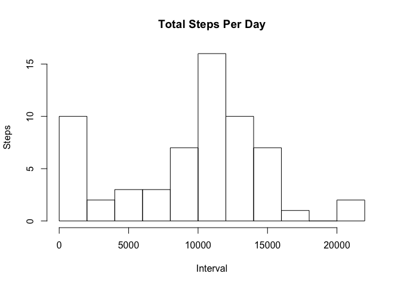
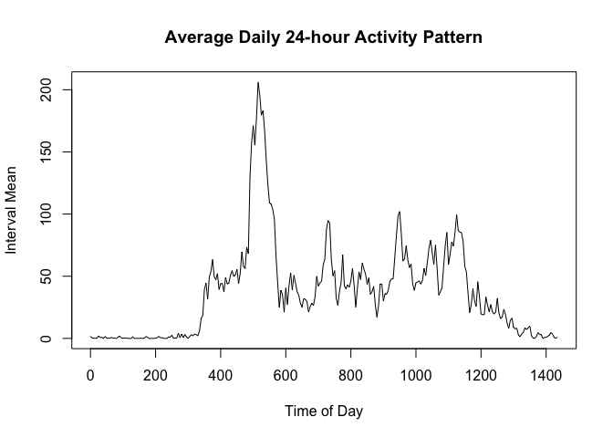
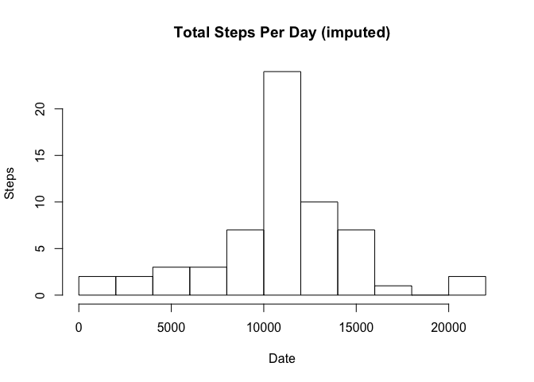
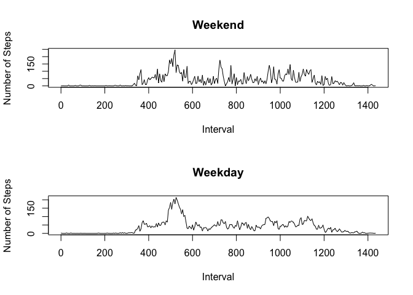

# Reproducible Research: Peer Assessment 1


## Loading and preprocessing the data

```r
library(dplyr)
```

```
## 
## Attaching package: 'dplyr'
## 
## The following object is masked from 'package:stats':
## 
##     filter
## 
## The following objects are masked from 'package:base':
## 
##     intersect, setdiff, setequal, union
```

```r
data <- read.csv("activity.csv")
data$time.interval <- sapply(data$interval, function(e) { m <- e; h <- 0; if(e >= 100) { m <- e %% 100; h <- e %/% 100; }; sprintf("%02d:%02d", h, m) })
data$interval <- sapply(data$interval, function(e) { m <- e; h <- 0; if(e >= 100) { m <- e %% 100; h <- e %/% 100; }; h * 60 + m })
stats <- data %>% group_by(date) %>% summarise(total.steps = sum(steps, na.rm = TRUE), mean.steps = mean(steps, na.rm = TRUE))
```

## What is mean total number of steps taken per day?

```r
hist(stats$total.steps, main = "Total Steps Per Day", breaks = 10, ylab = "Steps", xlab = "Interval")
```

 

```r
summary(stats$total.steps)
```

```
##    Min. 1st Qu.  Median    Mean 3rd Qu.    Max. 
##       0    6778   10400    9354   12810   21190
```

## What is the average daily activity pattern?

```r
plot(data %>% group_by(interval) %>% summarise(interval.mean = mean(steps, na.rm = TRUE)), type = "l", main = "Average Daily 24-hour Activity Pattern", ylab = "Interval Mean", xlab = "Time of Day")
```

 


## Imputing missing values
There are 2304 NAs out of 17568 observations in the activity dataset.


```r
interval.mean <- data %>% group_by(interval) %>% summarise(interval.mean = mean(steps, na.rm = TRUE))

imputed.data <- merge(data, interval.mean)

NAs <- is.na(imputed.data$steps)
imputed.data$steps[NAs] <- imputed.data$interval.mean[NAs]
imputed.data$interval.mean <- NULL
```

There are 0 NAs out of 17568 observations in the imputed activity dataset.


```r
imputed.stats <- imputed.data %>% group_by(date) %>% summarise(total.steps = sum(steps, na.rm = TRUE), mean.steps = mean(steps, na.rm = TRUE))
hist(imputed.stats$total.steps, main = "Total Steps Per Day (imputed)", breaks = 10, ylab = "Steps", xlab = "Date")
```

 

```r
summary(imputed.stats$total.steps)
```

```
##    Min. 1st Qu.  Median    Mean 3rd Qu.    Max. 
##      41    9819   10770   10770   12810   21190
```


## Are there differences in activity patterns between weekdays and weekends?

```r
library(timeDate)
weekend <- isWeekend(imputed.data$date)
par(mfrow = c(2, 1))
plot(data[weekend,] %>% group_by(interval) %>% summarise(interval.mean = mean(steps, na.rm = TRUE)), type = "l", main = "Weekend", ylab = "Number of Stepsn", xlab = "Interval")
plot(data[!weekend,] %>% group_by(interval) %>% summarise(interval.mean = mean(steps, na.rm = TRUE)), type = "l", main = "Weekday", ylab = "Number of Steps", xlab = "Interval")
```

 

